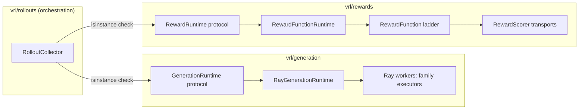
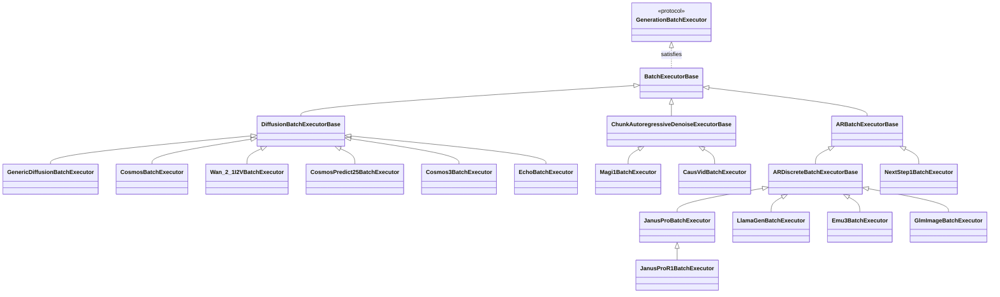
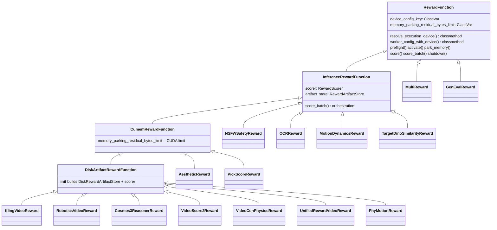

# VRL Engine Architecture — Class Reference

The core engine is **two inference engines with one shape**: generation
(vrl/generation) produces samples, reward (vrl/rewards) scores them, and
vrl/rollouts orchestrates the loop without importing either implementation.
Both engines expose the same lifecycle to their consumer —
`preflight → activate → work → offload/park → shutdown` — and both are
consumed only through runtime-checkable protocols, so orchestration code
never sees Ray, torch, or HTTP.

---

## 1. Shared foundations

| Class | Where | Role |
|---|---|---|
| `TerminalRuntimeError(RuntimeError)` | `vrl/runtime_errors.py` | Root of all "the fleet is dead, stop retrying" failures. |
| `RuntimePhase`, `RuntimeLifecycle`, `RuntimeLifecycleError` | `vrl/utils/lifecycle.py` | Owner-labeled lifecycle FSM. Both engine runtimes drive their phase transitions through it, which is what makes the two lifecycles provably identical. |
| `OperationDeadline`, `OperationTimeout(TerminalRuntimeError)` | `vrl/utils/deadline.py` | Bounded-wait primitive; expiry is terminal by design. |
| `RayCallDeadline(OperationDeadline)`, `RayOperationTimeout(OperationTimeout)`, `RayOperationCancelled(TerminalRuntimeError)` | `vrl/ray/operation_deadline.py` | The same deadline vocabulary specialized for Ray calls. |
| `CumemPool` | `vrl/utils/cuda_memory.py` | Tagged CUDA allocation pool: build model state inside it, later park physical pages to pinned host RAM and verify the residual (`validate_parking_residual`, `CUDA_RUNTIME_RESIDUAL_BYTES_LIMIT`). Used by generation workers and CuMem rewards alike. |

### Ray infrastructure (`vrl/ray`)

| Class | Role |
|---|---|
| `ClusterTopology` | Raw cluster facts (visible GPUs, nodes) read once from Ray. |
| `RayActorHandle`, `RayActorGroup` | Typed handles for launched actors; a group owns launch + id uniqueness. |
| `RayActorDispatcher`, `RayActorJob`, `RayActorCallError(TerminalRuntimeError)` | Admission-controlled async dispatch of actor calls. |
| `RolePlacement`, `GlobalRayPlacementOwner` | Placement-group lifecycle per role (create/probe/assign/remove). |
| `RoleResourceConfig` → `WorkerRoleResourceConfig` → `RolloutResourceConfig` \| `RewardResourceConfig` | Typed per-role resource schema ladder. |
| `DistributedResourceConfig`, `ResolvedDistributedResources`, `BundleLayout` | User schema → resolved topology → placement bundles. |
| `ActorLeasePolicy`, `PhaseHandoffPolicy`, `RayLifecyclePlan` | Derived once from GPU topology: who owns the GPU in which phase, and whether generation/reward must park at a handoff. The collector reads this plan; the runtimes never decide it themselves. |

---

## 2. Generation engine (`vrl/generation`)

### 2.1 The protocol seam (`protocols.py`)

One request flows: collector → `GenerationRuntime` → split into
`GenerationSampleBatch`es → dispatched to Ray workers → each worker's
`GenerationBatchExecutor.forward_batch(batch)` returns a `BatchPayload` →
driver-side `GenerationBatchGatherer.gather_batches()` reassembles the
`GenerationOutput`.

| Protocol | Members | Why it exists |
|---|---|---|
| `GenerationRuntime` | `current_policy_version`, `requires_driver_model_offload`, `preflight/activate/generate/offload/shutdown` | The engine's only face toward vrl/rollouts (dual of `RewardRuntime`). isinstance-checked at `rollouts/collector/core.py`. |
| `GenerationBatchExecutor` | `family`, `task`, `forward_batch`, `gather_batches` | The model-family plugin contract; keeps `if family == ...` out of neutral execution code. |
| `GenerationBatchGatherer` | `gather_batches` | The model-free slice of the executor: reassembly runs driver-side where no model is loaded, so it ships separately in the launch contract. |
| `BatchSizeProbeExecutor` | `forward_probe_batch(..., execute_steps=)` | Optional capability (isinstance-probed, like reward's `MemoryParkingScorer`): truncated execution for `samples_per_generation_batch: auto` memory probing. Only diffusion families implement it — their memory peaks in early denoise steps; AR peaks at the last token, so a truncated AR run would measure a lie. |
| `BatchPayload = Any` | — | Deliberate: the payload's shape is owned by the binding that produced it (diffusion latents vs AR tokens share nothing useful). |

### 2.2 Driver side (`ray/`)

| Class | Owns |
|---|---|
| `RayGenerationRuntime` | The public lifecycle: admission, which failure is terminal, staged policy installs while inactive (`_PendingPolicyInstall`), activate/offload semantics. Implements `GenerationRuntime`. |
| `RayGenerationSession` | The concrete resources of one launched fleet: worker handles, sleep/wake (memory parking with validated `WorkerMemoryParkingSnapshot` evidence), graceful policy release, kill-and-retain cleanup. Owns no public lifecycle. |
| `RayGenerationLauncher` / `RayGenerationLaunchInputs` | Building the fleet: placement, actor construction from the launch contract. |
| `RayGenerationExecutor` | Driver-side dispatch of sample batches to worker actors (through `RayActorDispatcher`), including pipelined execution and OOM-split handling. |
| `GenerationWeightSync` (protocol) / `RayGenerationWeightSync` | Pushing trainer state into rollout workers (`push_to_rollout_workers(state_ref, policy_version)`), versioned slots for continuous mode. |
| `RolloutWorkerHealthMonitor` / `RolloutWorkerUnreachable(TerminalRuntimeError)` | Bounded health probes; an unreachable worker is terminal. |
| `PipelinedRequestProgress` / `PipelinedProgressError(TerminalRuntimeError)` | Cross-actor progress accounting for pipelined requests. |
| `RolloutWorkerConfig`, `RayGenerationConfig` | Typed config for the fleet. |
| `GenerationRuntimeLaunchContract` (`launch_contract.py`) | The serializable recipe a Ray actor rebuilds its executor from: `family`, `model_build`, `expected_model_identity`, `executor_kwargs`, `policy_version`, profiler and offload flags. `__post_init__` enforces primitives-only/picklable content so a live driver object fails on the driver, not inside actor deserialization. Twin: `RewardWorkerLaunchContract`. |

### 2.3 Worker side (`execution/`)

| Class | Role |
|---|---|
| `RayGenerationWorker` (`ray/worker.py`) | The Ray actor shell; delegates to the core. |
| `GenerationWorkerCore` | Worker-process brain: validates the launch contract, builds the family executor, isinstance-probes `BatchSizeProbeExecutor` for auto batch sizing, runs forward/probe calls. |
| `WorkerMemoryParking` | Whole-model GPU↔pinned-host parking with phase tracking; produces `WorkerMemoryParkingSnapshot` evidence the driver validates. |
| `DistributedExecutionPlanner` → `DistributedGenerationPlan`, `DeviceAssignment` | Splits a request into per-worker batch assignments. |
| `EnginePlan` (`planner.py`) | The resolved per-request plan: which `sample_batches` run where. |
| `GenerationSampleBatch`, `SampleAlignedValues`, `BatchResultWithIdentity` (`sample_batches.py`) | The batch coordinate system: a batch is a slice of samples (`prompt_index`, `sample_start`, `sample_count`), not a time segment. `SampleAlignedValues` slices per-sample tensors consistently. |
| `GenerationBatchEnvelope` / `GenerationBatchResult` (`execution/types.py`) | The wire pair around one dispatched batch. |
| `BatchSizeProbeTrial` / `BatchSizeProbeResult`, `BatchMemoryReading`, `AffinePeakFit` | Auto-sizing telemetry: probe trials fit an affine peak-memory model to pick the widest safe batch. |
| `BatchProduceFence`, `QueryableCompletion`, `StaleSlotDiscard`, `PipelinedRequestOutOfMemory` | Pipelined-execution coordination and failure signaling. |

### 2.4 Executor ladder (bindings × families)

`BatchExecutorBase` (`execution/executor_base.py`) is the shared
implementation base satisfying `GenerationBatchExecutor`. Three bindings
specialize it per generation paradigm; model families subclass the binding
base (or use its generic implementation directly):

| Binding | Base / generic | Gatherer | Data types | Families |
|---|---|---|---|---|
| `full_sequence_denoise` | `DiffusionBatchExecutorBase`; families with no custom per-batch logic get `GenericDiffusionBatchExecutor` via the registry default | `DiffusionBatchGatherer` | `DiffusionSamplingParams`, `DiffusionRequestLayout`, `DiffusionBatchResult`, `ReferenceConditionedBatches` (mixin for i2v reference conditioning) | cosmos predict2/2.5/3, wan 2.1 i2v, echo; every other diffusion family (sana, flux, sd3.5, qwen-image, pixart-sigma, lumina2, mochi, hunyuan image/video, cogvideox, …) uses the generic executor via the registry default |
| `chunk_autoregressive_denoise` | `ChunkAutoregressiveDenoiseExecutorBase` | `ChunkAutoregressiveDenoiseGatherer` | `ChunkAutoregressiveDenoiseResult` | magi-1, causvid. Here "chunk" means a **temporal chunk** of the video (causal-chunk generation) — a different concept from sample batches. |
| `token_autoregressive` | `ARBatchExecutorBase` → `ARDiscreteBatchExecutorBase` (discrete-token specialization) | `ARDiscreteBatchGatherer` | `ARBatchPayload` (protocol), `ARSamplingParams`, `ARRequestLayout`, `ARBatchInputs`, `ARDiscreteBatchResult` | janus-pro (+R1), llamagen, emu3, glm-image; nextstep-1 sits on `ARBatchExecutorBase` directly (continuous AR). |

Below the executors, `steps/` holds the paradigm-neutral inner loops:
denoise (`DenoiseLoopConfig`, `DenoiseSDEParams`, `DenoiseLoopResult`,
`DenoiseTrajectoryBuffers`, TeaCache classes) and token
(`TokenLoopInit`, `TokenStepBatch`, `TokenStepOutput`,
`TokenAutoregressiveLoop`/`Envelope` in `composition/`).

### 2.5 Request/output types (`types.py`)

`GenerationInput` → `GenerationRequest` (and `VideoGenerationRequest`) enter
the engine; `GenerationSampleRow` and `GenerationOutput` leave it. These are
the collector-facing dataclasses; everything batch-shaped stays inside the
engine.

---

## 3. Reward engine (`vrl/rewards`)

### 3.1 Contracts (torch-free layer)

| Module | Classes | Role |
|---|---|---|
| `protocols.py` | `RewardRuntime` | The engine's only face toward vrl/rollouts (dual of `GenerationRuntime`): `scoring_is_nonblocking`, `external_accelerator_isolation_verified`, `preflight/activate/score/park_memory/shutdown`. isinstance-checked at `rollouts/collector/core.py`. |
| | `RewardScorer` | The transport seam below `RewardFunction` (dual of the Ray executor layer): `score_batch(request) -> results`, `shutdown`, plus the two capability flags. Runtime-checkable; validated **once, completely** at scorer injection. |
| | `RemoteReadyScorer` | Optional capability: remote transports expose `ensure_ready()` so a broken service fails at preflight, not after the first generation batch. |
| | `MemoryParkingScorer` | Optional capability (dual of `BatchSizeProbeExecutor`): `requires_memory_parking`, `activate`, `park_memory` for verified GPU parking. |
| | `ArtifactRetainingError` | Error capability: `retain_reward_artifacts` declared by transport errors whose scoring state is unknown — the artifact owner keeps shared files alive. `RemoteRewardServiceError` satisfies it. |
| `inference.py` | `RewardInferenceArtifact`, `RewardInferenceRequest`, `RewardInferenceResult` | The schema both transports exchange; the service wire format derives its field sets from these dataclasses. `RewardInferenceRequest.validate_and_order_results()` is the identity guard every transport runs: one typed, finite result per artifact, restored to request order. |
| `artifacts.py` | `MediaType`, `ArtifactFormat`, `RewardArtifactStore` (protocol), `InMemoryRewardArtifactStore`, `DiskRewardArtifactStore` | The store seam: `materialize` builds artifacts; exactly one of `release`/`retain` runs at a terminal state. In-memory is the default; the disk store writes integrity-checked files (mp4/`.pt`) for the shared-filesystem service transport and tracks path ownership so a file a live remote scorer might read is never deleted. |
| `launch_contract.py` | `RewardWorkerLaunchContract` | The typed closed key set the runtime branches on, parsed once from `worker_config` by both processes that read it (in-process scorer, standalone service). Twin: `GenerationRuntimeLaunchContract`. |
| `types.py` | `RewardSample`, `RewardOutput` | Collector-facing input/output pair. |

### 3.2 The RewardFunction ladder (`base.py`)

The ladder encodes **capabilities the registry and runtime check by type**,
not taxonomy:

- **`RewardFunction`** — plugin base: lifecycle defaults, scalar→batch
  default scoring, and the device policy. `device_config_key` names each
  reward's device kwarg (NSFW overrides to `classifier_device`);
  `resolve_execution_device` is the overridable device-ceiling hook
  (distributed resources own placement; component config may only downgrade
  to CPU — OCR overrides it to force CPU for its CPU-only engine);
  `worker_config_with_device` applies the same policy at the config-bag
  boundary.
- **`InferenceRewardFunction`** — owns the materialize → score → validate →
  release-or-retain orchestration around one injected `RewardScorer` and one
  `RewardArtifactStore` (in-memory by default). Every transport, including
  test fakes, passes the same result-identity guard.
- **`CumemRewardFunction`** — declares that all model CUDA state is built in
  the tagged pool, enabling verified memory parking
  (`memory_parking_residual_bytes_limit`).
- **`DiskArtifactRewardFunction`** — real constructor that builds the
  `DiskRewardArtifactStore` and (unless a ready scorer is injected) the
  in-process scorer from `model_factory` + `worker_config`. Registry
  preflight gates HTTP inference on `issubclass(reward_cls, DiskArtifactRewardFunction)` —
  in-memory media cannot ride the HTTP transport.
- **`MultiReward`** — weighted composite built by the registry
  (`MultiReward.from_dict`, called from `vrl/scripts/common/factory.py`);
  aggregates both capability flags with `all()` across components (one
  blocking or unverified component makes the composite blocking/unverified)
  and fans lifecycle calls out to children with retryable teardown.
- **`GenEvalReward`** — pure scoring function, no inference transport.

### 3.3 Runtime and scorer transports

| Class | Role |
|---|---|
| `RewardFunctionRuntime` (`runtime.py`) | Implements `RewardRuntime` around the configured `RewardFunction`: lifecycle FSM, deadlines, parking gate (`validate_parking_residual`). What `RayGenerationRuntime` is to generation. |
| `InProcessRewardScorer` (`runtime.py`) | `RewardScorer` + `MemoryParkingScorer` implementation: builds the reward model lazily from `RewardWorkerLaunchContract.model_factory` (inside a `CumemPool` when parking is on), scores via `_score_artifacts` (batch hook or per-artifact call loop). |
| `build_reward_scorer` (`runtime.py`) | Factory: worker config or `RewardInferenceConfig` → in-process or HTTP scorer. |
| `HttpRewardScorer` (`service/client.py`) | `RewardScorer` + `RemoteReadyScorer` over HTTP: checks service identity/capabilities at `ensure_ready`, requires the shared-filesystem artifact transport, marks ambiguous transport failures with `retain_reward_artifacts`. |
| `RewardService`, `RewardServiceConfig` (`service/server.py`) | The standalone scoring process: parses the same launch contract, re-verifies artifact integrity (`sha256_file`), runs the same `validate_and_order_results` guard server-side. |
| `RewardScorerOwner` (`service/owner.py`) | Runs every runtime operation on one dedicated event-loop thread inside the service. |
| `RewardServiceInfo`, `RewardServiceErrorCode`, `RewardServiceProtocolError(ValueError)`, `RemoteRewardServiceError(RuntimeError)` (`service/protocol.py`) | The wire protocol vocabulary; `RemoteRewardServiceError` carries `retain_reward_artifacts` (typed ctor field) and thereby satisfies `ArtifactRetainingError`. |

### 3.4 Reward models (`models/`)

| Class | Inherits | Notes |
|---|---|---|
| `RewardModel` | Protocol | What a scorer drives: `__call__(artifact) -> scores` (optional `score_batch`). |
| `LazyTorchModule` | ABC | Defers module construction to `prepare_for_inference()` so weights land in the runtime's CuMem build frame, never in `__init__`. |
| `TorchRewardModel` | `LazyTorchModule` | Adds the media-scoring loop (`score_media`). |
| `AestheticRewardModel`, `PickScoreRewardModel` | `TorchRewardModel` | CLIP-head scorers. |
| `MotionDynamicsModel`, `TargetDinoSimilarityModel` | `LazyTorchModule` | RAFT optical flow; DINO similarity. |
| `KlingVideoRewardModel` (+ `KlingQwen2VLRewardModel(Qwen2VLForConditionalGeneration)`), `VideoScore2Model`, `RoboticsVideoRewardModel`, `Cosmos3ReasonerRewardModel`, `UnifiedRewardVideoModel`, `VideoConPhysicsModel`, `PhyMotionModel`, `OCRRewardModel`, `NSFWSafetyRewardModel` | plain classes | Satisfy `RewardModel` structurally; built by `model_factory` dotted paths from the launch contract. |

---

## 4. Orchestration consumers (`vrl/rollouts`)

vrl/rollouts holds no engine code — it drives both engines through their
protocols and owns the GPU handoff choreography that `RayLifecyclePlan`
prescribes.

| Class | Role |
|---|---|
| `RolloutCollector` (`collector/core.py`) | The consumer of both engines: isinstance-validates `GenerationRuntime` and `RewardRuntime` at construction, runs generate → score, applies the lifecycle plan's offload/park decisions. `UnscoredRollout` is its intermediate product. |
| `GenerationRequestBuilder`, `CollectorRequest` | Prompt batch → `GenerationRequest`. |
| `TrajectoryRolloutBatchBuilder`, `RolloutBatchBuildContext`, `RolloutBatch` | Scored outputs → training batches. |
| `RolloutSchedule` (protocol) → `StrictOnPolicyRolloutSchedule`, `ContinuousRolloutSchedule` | When to generate vs train. Strict drains everything per iteration; continuous keeps a producer/consumer pipeline running (`ContinuousRolloutOwner` / `Producer` / `Consumer` / `Queue`, `StalenessPolicy`, `ContinuousRolloutSettings/Item/ProducerState`). |
| `RolloutRuntimeCoordinator`, `RolloutCollectorControl` (protocol) | Wires schedule ↔ collector ↔ trainer phases (`RolloutIteration`, `RolloutScheduleMode`, `RewardCollectionMode`). |
| `Evaluator` (protocol) → `ReplayEvaluatorBase` (ABC) → `TokenLogProbEvaluator`, `ContinuousTokenLogProbEvaluator`, `MultiSegmentTokenLogProbEvaluator`, `DiffusionSDELogProbEvaluator`, `ChunkAutoregressiveDenoiseLogProbEvaluator` | Replay-side log-prob evaluation per generation paradigm; produce `SegmentSignal` / `TrajectorySignalBatch` via `TrajectorySignalBuilder`. |
| `RolloutStats`, `StatsSink` (protocol) → `LoggingStatsSink` / `JsonlStatsSink` / `MultiStatsSink` | Phase timing and throughput reporting. |

---

## 5. The duality map

| Concept | Generation | Reward |
|---|---|---|
| Consumer-facing protocol | `GenerationRuntime` | `RewardRuntime` |
| Runtime implementation | `RayGenerationRuntime` | `RewardFunctionRuntime` |
| Transport/executor seam | `GenerationBatchExecutor` (+ Ray dispatch) | `RewardScorer` (in-process / HTTP) |
| Optional capability, isinstance-probed | `BatchSizeProbeExecutor` (truncated memory probe) | `MemoryParkingScorer` (verified GPU parking) |
| Launch boundary | `GenerationRuntimeLaunchContract` | `RewardWorkerLaunchContract` |
| Result identity guard | gatherer reassembly over batch identities | `RewardInferenceRequest.validate_and_order_results()` |
| Memory lease vocabulary | `activate` / `offload` (park workers) | `activate` / `park_memory` |
| Lifecycle | `preflight → activate → generate → offload → shutdown` | `preflight → activate → score → park_memory → shutdown` |
| Shared machinery | `RuntimeLifecycle` FSM, `OperationDeadline`, `CumemPool`, `RayLifecyclePlan` | same |

The intentional asymmetry: generation always crosses a Ray process boundary
(GPU workers), while reward scores **in the driver process** by default and
only crosses a boundary for the HTTP service — so generation's transport
layer is actors + dispatch + weight sync, while reward's is a scorer object.
Both end at the same shape: a runtime the collector can hold without knowing
what is behind it.
